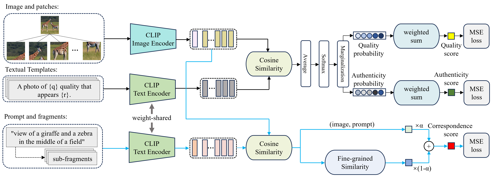
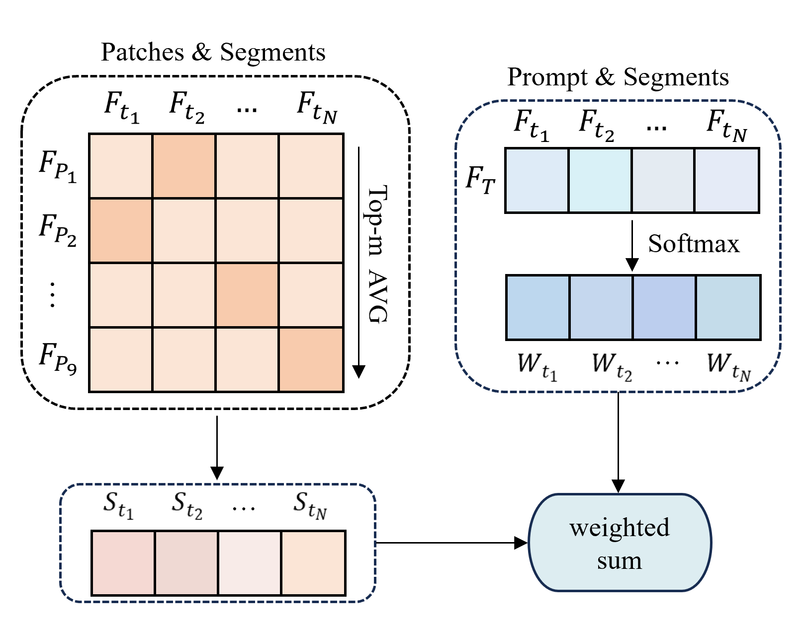

# MGS: Multi-Granularity Similarity for AI Generated Image Quality Assessment

## Overview
This paper proposes a multi-dimensional AGIQA method based on joint text templates and multi-granularity text-image correspondence.The proposed method leverages the pre-trained CLIP model to collaboratively assess the quality of AGIs: it constructs joint text descriptions that encompass both visual quality and authenticity to facilitate their co-evaluation; additionally, it segments the original prompt into multiple fragments and computes the similarity between the image and both the complete prompt and its individual fragments, thereby achieving a multi-granularity assessment of text-image correspondence. 




## Requirements
- Python 3.8+
- PyTorch 2.0+
- torchvision
- Additional dependencies:
```bash
pip install ftfy tqdm scipy pandas numpy Pillow tensorboard openai-clip
```

## Datasets
Download the following datasets and place them in the `./data` directory:
- [**AGIQA-1K**](https://github.com/lcysyzxdxc/AGIQA-1k-Database)
- [**AGIQA-3K**](https://github.com/lcysyzxdxc/AGIQA-3k-Database)
- [**AIGCIQA2023**](https://github.com/wangjiarui153/AIGCIQA2023)

### Training
```bash
bash start_training.sh
```

### Testing
```bash
bash start_testing.sh
```

## Citation
If you find our work useful in your research, please consider citing:
```bibtex
@article{wu2025towards,
  title={MGA: Multi-Granularity Alignment for AI Generated Image Quality Assessment},
  author={Wu, Yi and Luo, Hang, and Liang, Jinxing},
  journal={IEEE Signal Processing Letters},
  year={2025},
  publisher={IEEE}
}
```

## Acknowledgements
This project is based on [IPCE](https://github.com/pf0607/IPCE) and [LIQE](https://github.com/zwx8981/LIQE). Thanks for these awesome works.
We also use [OpenAI CLIP](https://github.com/openai/CLIP) as the vision/text encoder backbone. We thank the authors for their excellent open-source work.

## License
This project is released for academic research use only. Please refer to the LICENSE file for more details.
