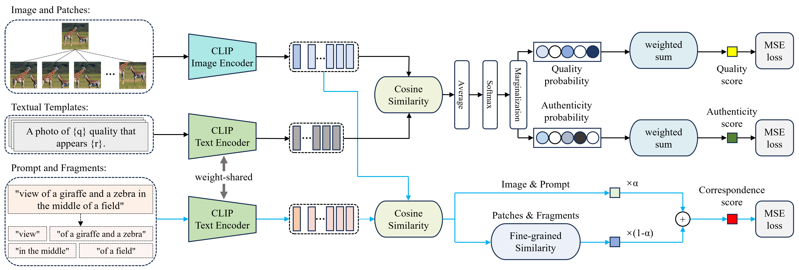
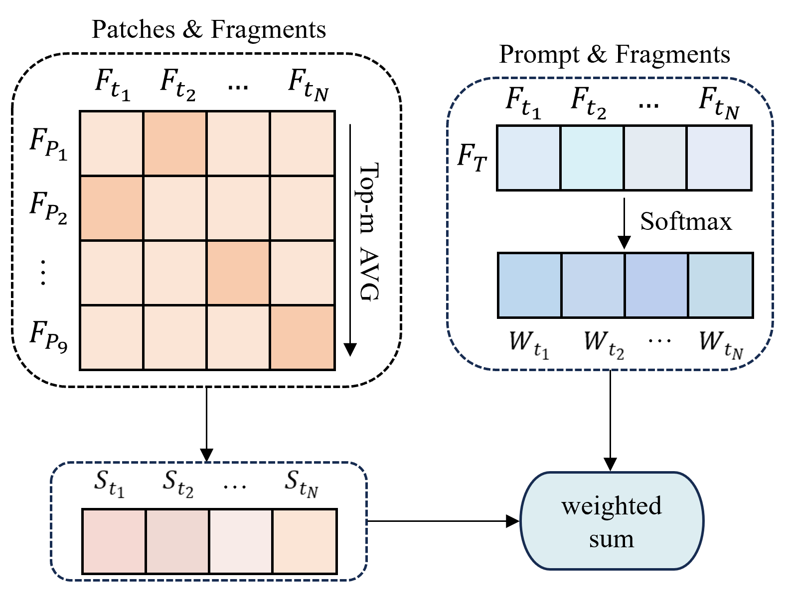

# Multi-Dimensional AI-Generated Image Quality Assessment viaJoint Text Template and Multi-Granularity Similarity

## Overview
We propose a multi-dimensional evaluation framework that enables the co-evaluation of quality and authenticity, as well as multi-granularity image–text correspondence assessment. Specifically, joint text template is constructed to co-evaluate image quality and authenticity. By dividing the image into patches and segmenting prompt into fragments, our method performs a multi-granularity correspondence analysis through similarity computation, and finally predicts three-dimensional scores.  




## Requirements
- Python 3.8+
- PyTorch 2.0+
- torchvision
- Additional dependencies:
```bash
pip install ftfy tqdm scipy pandas numpy Pillow tensorboard openai-clip
```

## Datasets
Download the following datasets and place them in the `./data` directory:
- [**AGIQA-1K**](https://github.com/lcysyzxdxc/AGIQA-1k-Database)
- [**AGIQA-3K**](https://github.com/lcysyzxdxc/AGIQA-3k-Database)
- [**AIGCIQA2023**](https://github.com/wangjiarui153/AIGCIQA2023)

### Training
```bash
bash start_training.sh
```

### Testing
```bash
bash start_testing.sh
```

## Citation
If you find our work useful in your research, please consider citing:
```bibtex
@article{WU2026,
title = {Multi-Dimensional AI-Generated Image Quality Assessment viaJoint Text Template and Multi-Granularity Similarity},
journal = {Pattern Recognition Letters},
year = {2026}
author = {Yi Wu and Hang Luo and Jinxing Liang}
}```


## License
This project is released for academic research use only. Please refer to the LICENSE file for more details.